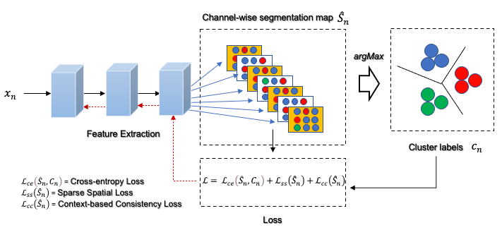

# Spatial_Guided_Self_Supervised_Clustering

A Spatial Guided Self-supervised Clustering Network for Medical Image Segmentation, MICCAI, 2021 by E. Ahn, D. Feng and J. Kim. 

<p align="left">
    
</p>
We propose a new spatial guided self-supervised clustering network (SGSCN) for medical image segmentation, where we introduce multiple loss functions designed to aid in grouping image pixels that are spatially connected and have similar feature representations. It iteratively learns feature representations and clustering assignment of each pixel in an end-to-end fashion from a single image. We also propose a context-based consistency loss that better delineates the shape and boundaries of image regions. It enforces all the pixels belonging to a cluster to be spatially close to the cluster centre.

## Installation

```bash
pip install -r requirements.txt
```

## Usage

```bash
python demo_final.py --input foldername
```


## Citation

If you find this repo useful in your work or research, please cite:

```
@misc{ahn2021spatial,
      title={A Spatial Guided Self-supervised Clustering Network for Medical Image Segmentation}, 
      author={Euijoon Ahn and Dagan Feng and Jinman Kim},
      year={2021},
      eprint={2107.04934},
      archivePrefix={arXiv},
      primaryClass={cs.CV}
}
```
